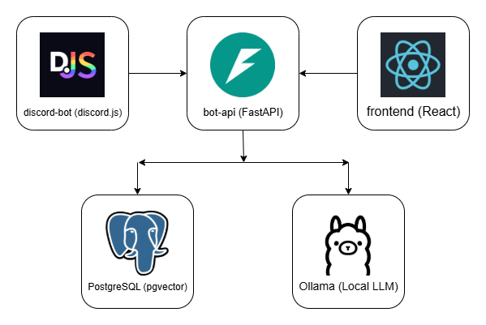

# discord-rag-bot

A self-hosted RAG (Retrieval-Augmented Generation) system with two interfaces: a Discord bot and a web app. Users upload PDF documents, which are chunked, embedded, and stored in a PostgreSQL vector database. Queries are answered by retrieving the most relevant document chunks and passing them as context to a locally-hosted LLM via Ollama.

## Architecture



| Package | Stack | Description |
|---------|-------|-------------|
| [`bot-api`](./bot-api/) | Python, FastAPI, LangChain, pgvector | RAG engine, REST API, Discord OAuth |
| [`discord-bot`](./discord-bot/) | Node.js, discord.js | Discord interface; thread-based chat sessions |
| [`frontend`](./frontend/) | React, TypeScript, Vite | Web interface; upload, chat, document management |

## How It Works

1. A user uploads a PDF through the Discord bot or the web app.
2. `bot-api` chunks the document, generates embeddings with a HuggingFace sentence-transformer, and stores them in PostgreSQL (pgvector), tagged with the user's Discord ID.
3. When the user asks a question, `bot-api` performs a cosine similarity search against their documents, injects the top results into a system prompt, and forwards the augmented request to Ollama.
4. The response is returned to whichever interface the user is in.

Each user's documents and queries are fully isolated by Discord ID.

## Prerequisites

All three services share a PostgreSQL database. You will need:

- PostgreSQL with the `pgvector` extension installed
- [Ollama](https://ollama.com) running with your chosen model pulled
- A Discord application created in the [Developer Portal](https://discord.com/developers/applications) with:
  - A bot token
  - OAuth2 with the Authorization Code grant enabled
  - A redirect URI pointing at the frontend

## Running Locally

Start each service in its own terminal. `bot-api` must be running before the other two.

```bash
# 1. bot-api
cd bot-api
cp .env.example .env && pip install -r requirements.txt
python main.py

# 2. discord-bot
cd discord-bot
cp .env.example .env && npm install
node deploy-commands.js   # run once to register slash commands
node index.js

# 3. frontend
cd frontend
cp .env.example .env && npm install
npm run dev
```

See each package's README for full environment variable reference:

- [bot-api/README.md](./bot-api/README.md)
- [discord-bot/README.md](./discord-bot/README.md)
- [frontend/README.md](./frontend/README.md)

## Shared Configuration

Two values must be kept in sync across packages:

| Value | Set in |
|-------|--------|
| `INTERNAL_API_KEY` | `bot-api/.env` and `discord-bot/.env` |
| `DATABASE_URL` | `bot-api/.env` and `discord-bot/.env` |

## Docker

Each package ships a `Dockerfile`. Build and run them independently, pointed at the same PostgreSQL and Ollama instances via environment variables.
